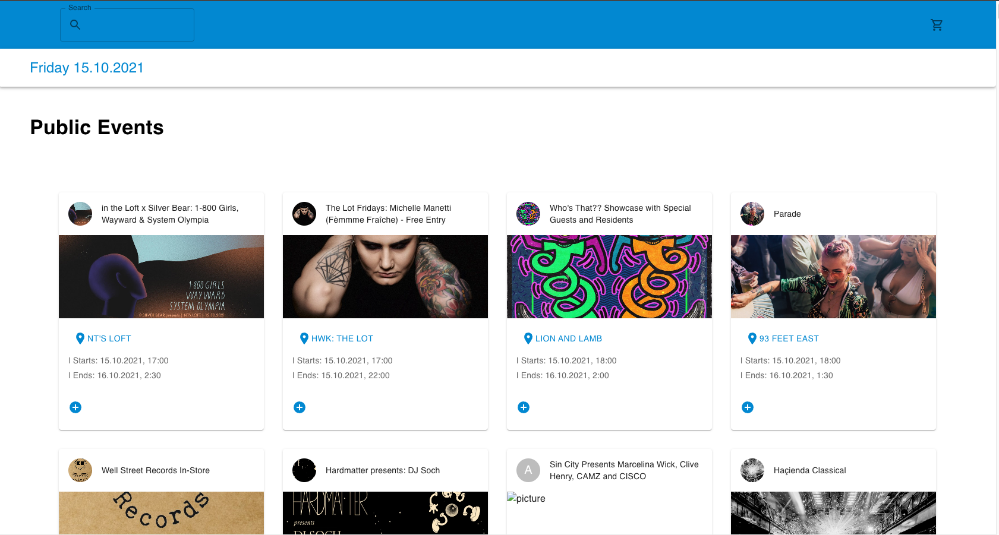

# Task

## Stack

- Typescript
- React
- MUI
- Jest

## Setup

- to clone respository open terminal and type `git clone https://github.com/mik9016/9050f680-d74d-4dbb-95ea-2a078af6b36b.git`
- To open go to the folder where project was cloned
- Open terminal and type `yarn install`
- to open app type `yarn start`
- to test type `yarn test`

# How it looks 

Enjoy!

